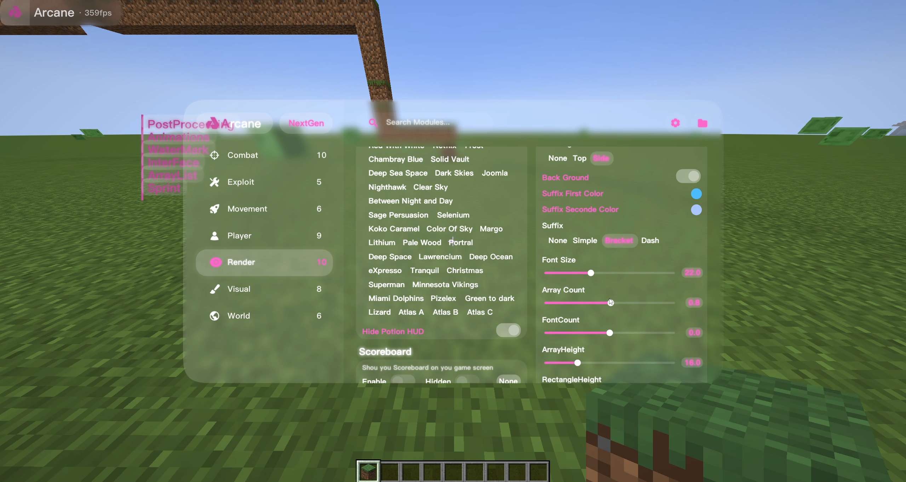
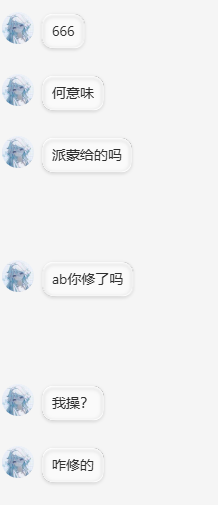
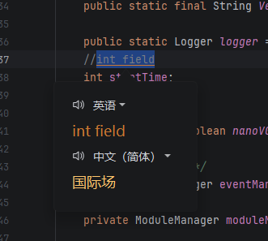
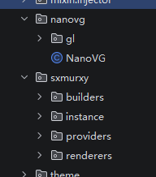
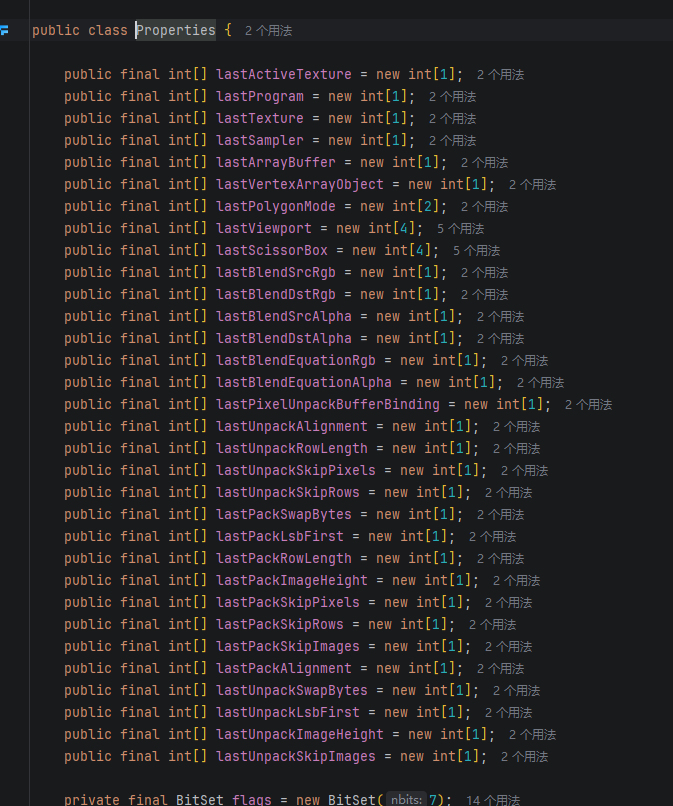

# Open-A

> 此客户端删除了部分重要代码，所以部分功能可能存在不可使用，如果你想使用这个垃圾狗屎Base那么你需要进行一些修复。

**Open-A** 是*ArcaneNG* Minecraft 客户端的原始代码版本 ，完全是由**孤月茫(AKA:Private512)**给我发送源码得到的。目标版本为 **Minecraft 1.21.4 Fabric**

> ⚠️ 本仓库**仅供学习与研究目的发布** —— 用于研究客户端侧游戏改造。在你不拥有的服务器上使用作弊客户端违反绝大多数服务器规则，请自行承担后果。

## 许可
本仓库以GPLV3协议开放，构建脚本与文档**仅供研究与学习使用**。如果你是 Arcane 的原作者并希望本仓库下架或重新授权，请提 Issues。虽然提了也不会搭理你。

## 截图

## 关于开发者-孤月茫(Private512)

- 开发者不了解NBT，具有狂躁易怒症
- 声称赚5000元但不公开支出明细
- 抽烟截图只发未打开包装的，收入只截图部分内容
- 前客户端**Arcane189**存在碰瓷opai视觉等行为
- 背刺巴结等行为

### 聊天记录

## 代码解析
此人的代码水准宛如一根成年的香蕉,在这里我不多赘述，看截图就行。

## 致谢

- **ArcaneNG**。
- 孤月茫自己
- NHCM-DEV(感谢他破解Arcane导致Gym跑路)
- Jetbrains